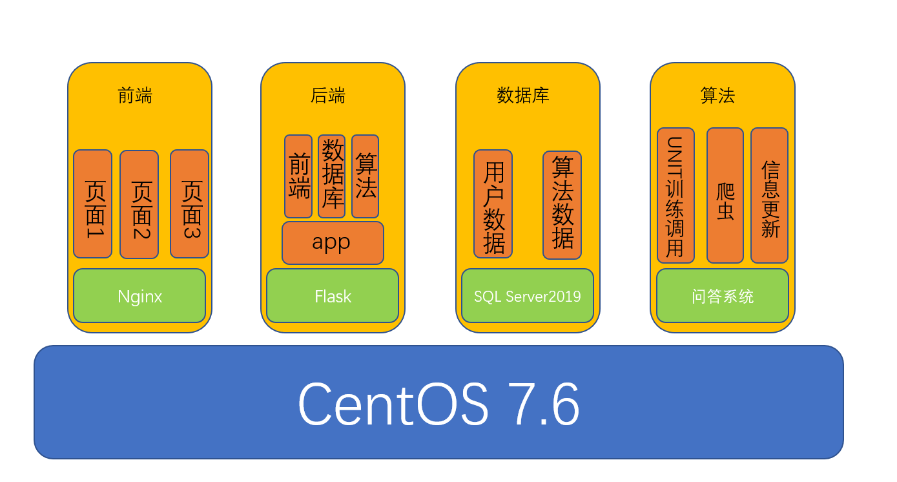

# Chat Robot





## 前端

### 安装Nginx

path:`/root`

```bash
mkdir tmp && cd /root/tmp && yum install -y make cmake gcc gcc-c++ pcre pcre-devel zlib zlib-devel openssl openssl-devel && wget https://nginx.org/download/nginx-1.22.1.tar.gz && tar -zxvf nginx-1.22.1.tar.gz && cd nginx-1.22.1/ && ./configure --prefix=/usr/local/nginx --with-http_stub_status_module --with-http_ssl_module --with-file-aio --with-http_realip_module && make && make install && ln -s /usr/local/nginx/sbin/nginx /usr/bin/nginx
```


### 配置Nginx

```bash
cd /usr/local/nginx/conf
vim nginx.conf
nginx
```

常用命令：

启动：nginx
重载加载配置：nginx -s reload
停止：nginx -s stop


## 后端(5000端口)

### 安装Anaconda

path:`/root`

```bash
cd tmp && wget --no-check-certificate https://mirrors.tuna.tsinghua.edu.cn/anaconda/archive/Anaconda3-2022.10-Linux-x86_64.sh && bash Anaconda3-2022.10-Linux-x86_64.sh
```


### 配置Anaconda


```bash
# 添加清华源
conda config --add channels https://mirrors.tuna.tsinghua.edu.cn/anaconda/pkgs/free/
conda config --add channels https://mirrors.tuna.tsinghua.edu.cn/anaconda/cloud/conda-forge/
conda config --add channels https://mirrors.tuna.tsinghua.edu.cn/anaconda/cloud/pytorch/
 
# 添加阿里云镜像源
conda config --add channels https://mirrors.aliyun.com/anaconda/pkgs/free/
conda config --add channels https://mirrors.aliyun.com/anaconda/pkgs/main/
 
# 添加中科大源
conda config --add channels https://mirrors.ustc.edu.cn/anaconda/pkgs/free/
conda config --add channels https://mirrors.ustc.edu.cn/anaconda/pkgs/main/
conda config --add channels https://mirrors.ustc.edu.cn/anaconda/cloud/conda-forge/
conda config --add channels https://mirrors.ustc.edu.cn/anaconda/cloud/msys2/
conda config --add channels https://mirrors.ustc.edu.cn/anaconda/cloud/bioconda/
conda config --add channels https://mirrors.ustc.edu.cn/anaconda/cloud/menpo/

# 设置搜索时显示通道地址
conda config --set show_channel_urls yes
```


## 数据库(1433端口)

### 安装SQLServer2019

path:`/root`

```bash
cd tmp && sudo curl -o /etc/yum.repos.d/mssql-server.repo https://packages.microsoft.com/config/rhel/7/mssql-server-2019.repo && sudo yum makecache && sudo yum install -y mssql-server && sudo /opt/mssql/bin/mssql-conf setup
```

- 选择使用的版本(2)

```
Choose an edition of SQL Server:
  1) Evaluation 
  2) Developer 
  3) Express
  4) Web
  5) Standard
  6) Enterprise
  7) Enterprise Core
  8) I bought a license through a retail sales channel and have a product key to enter.
```

- 设置 SQL Server 系统管理员密码

```bash
Enter the SQL Server system administrator password: <Password>
Confirm the SQL Server system administrator password:<Confirm Password>
```

- 使用 unixODBC 开发包安装 mssql-tools

```bash
sudo curl -o /etc/yum.repos.d/msprod.repo https://packages.microsoft.com/config/rhel/7/prod.repo && sudo yum -y install mssql-tools unixODBC-devel
```

- 环境路径配置

```bash
echo 'export PATH="$PATH:/opt/mssql-tools/bin"' >> ~/.bash_profile && echo 'export PATH="$PATH:/opt/mssql-tools/bin"' >> ~/.bashrc && source ~/.bashrc
```

- 本地连接

```bash
sqlcmd -S localhost -U SA -P 'skSK1234'
```

- 安装python所需的pymssql库

```
conda install pymssql
```


## 视频链接
1. 场景划分，前后端数据库初步构建，文心大模型调用与训练方法
   【校园对话机器人项目 11月工作汇报】 https://www.bilibili.com/video/BV1fP4y1X7YP
2. 全项目讲解
   【校园对话机器人项目】 https://www.bilibili.com/video/BV1cR4y1679A
